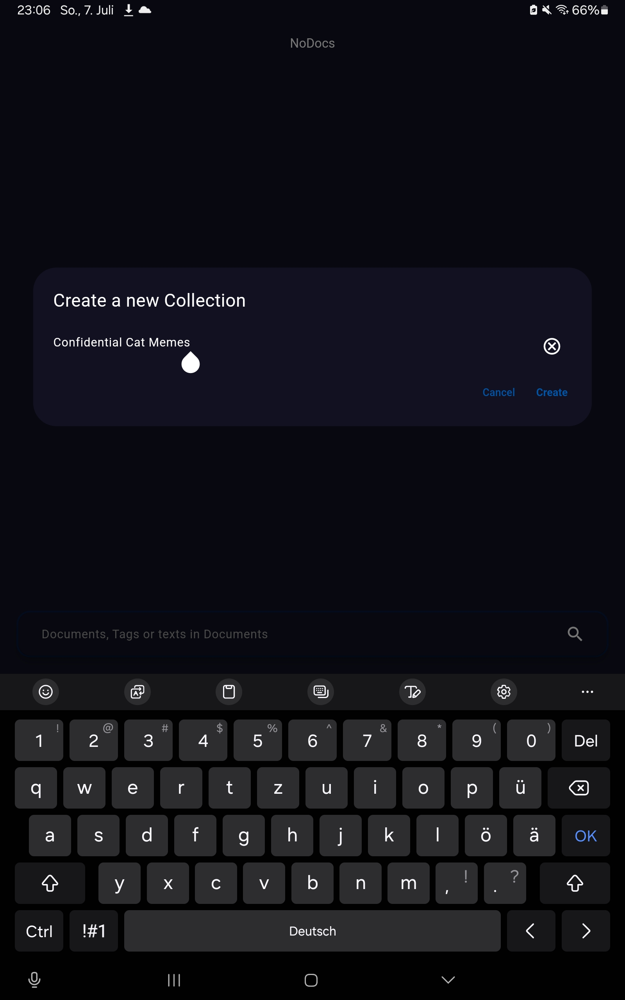

# nodocs

A Flutter Project to scan documents and manage them.

## Getting Started

This project is a starting point for a Flutter application.

A few resources to get you started if this is your first Flutter project:

- [Lab: Write your first Flutter app](https://docs.flutter.dev/get-started/codelab)
- [Cookbook: Useful Flutter samples](https://docs.flutter.dev/cookbook)

For help getting started with Flutter development, view the
[online documentation](https://docs.flutter.dev/), which offers tutorials,
samples, guidance on mobile development, and a full API reference.


## Development

### Useful commands

#### Regenerate generated sources

```
dart run build_runner build
```

#### Regenerate splash screens
```
dart run flutter_native_splash:create
```

#### Regenerate icon files
```
flutter pub run flutter_launcher_icons
```

#### Regenerate translation keys
```
dart run easy_localization:generate -S assets/translations -f keys -O lib/gen -o locale_keys.g.dart
```


# User Guide
The following guide describes how to use the App.
## Home Screen
This is the first page you will see if you start the App.
The page itself contains two features and the navigation bar. The two features are the Search feature and the Collection Menu feature.</br>

</br></br>
### Collection Menu
The Collection Menu is kind of a file explorer. You will see all your Collections and PDF documents there. You can open Collections to see what's inside them by clicking on them. You can also click on PDF documents to open them in the PDF Viewer of the app which will be described later.</br>An unfolded collection with documents inside may look like this:</br>
</br></br>
You also have a context menu which you are able to activate with a long press on the collection or the document.
#### Collection Context Menu
When long pressing a collection you will have those options:</br>
</br></br>
- Clicking the `Rename` button will open up a dialog where you can set a new name for the collection (confirm with `Confirm`, cancel with `Cancel`):

</br></br>
- Clicking the `Share` button will "zip" the folder and all files inside, so you can share it across your apps:

</br></br>
- Clicking the `Upload File` button will allow you to upload a file from your file system into the collection.</br>
- Clicking the `Delete` button will open up a confirmation dialog. Warning! If you click on `Confirm` this will delete all files and collections inside the collection. As always cancel with `Cancel`.
#### PDF File Context Menu
When long pressing a collection you will have those options:</br>
</br></br>
- Clicking `Rename` will allow you to rename the document as described above.
- Clicking `Share` will allow you to share the PDF document.
- Clicking `Delete` will delete the document. That also works the same way as for collections.
### Home Navigation
In the navigation of the home page you can also create new collections by clicking on `New Collection`. Then you will see this dialog where you can insert the name of the new Collection (create with `Create`, cancel with `Cancel`):

</br></br>

Also, you can access the settings by clicking on `Settings`.

And you can scan your documents with the integrated scan feature by clicking on `Scan Document`.

The Settings page and the Scan page are described below.

### Search
The search feature can be opened by pressing the search bar on the home page. In the input field you are able to search for the following things:
- Search for PDF documents by name:

</br>
- Search for Tags by their names:

</br>
- Search for words or characters inside documents (see `n matches found` from the examples above)

When you have found the document you were looking for you can open it in the PDF viewer by clicking on it.

## PDF viewer
The PDF viewer can be opened as described above. It contains two features. The Edit Tags feature and the Search feature which can be accessed by pressing this button:</br>
</br>

### Search
The Search feature allows you to search for a text in the document. After typing in your text you have to click the search button of your keyboard.
You jump to the next occurrence of a word with the right arrow button, and you can jump to the previous occurrence on the left arrow button:</br>
</br>

### Edit Tags
The Tag feature allows you to create new Tags and directly link them to your document. Also, you can remove existing Tags from the document. If you remove a Tag and confirm with `Save` the Tag might be deleted if no other document is linked to this Tag. Another feature is to add an existing Tag from another document to it by selecting them.

All changes made in the Edit Tags Dialog must be confirmed with `Save` in order to persist.

#### Create new Tag
To create a new Tag type in the name of it. Then confirm the Tag with the add Button.</br>
</br>

#### Select/Remove an existing Tag
To select an existing Tag just tap it. To unselect it just tap it again. This way you can also remove Tags from documents.</br>
</br>

## Scan Page
The `Scan Page` can be used to make photos of documents and upload existing photos in order to convert them into a document later.
</br>
Those are the features:
1. The `Scan Document` button captures a photo
2. The gallery icon allows you to add a photo from your gallery
3. The Last Image Preview can be clicked to finish scanning your documents and continue with the PDF creation, Tag adding, Collection selecting, ... (As described under `Save Page`)

After making the photo or uploading it you will land on the Crop Page.
## Crop Page
This page allows you to give your image the final adjustment, so it looks good in the PDF later.
Therefore, you have to click on the `Crop` button. This will open the `Cropper` where you can make those adjustments.

The Navigation Bar offers those features:</br>
</br>
1. The `Retake Photo` button allows you to discard the photo.
2. The `Keep Scanning` button saves the image and allows you to make or upload another image to the document.
3. By clicking the `Save Document` button you will be forwarded to the `Save Page` which is described below.

## Save Page
The `Save Page` is used to do the following:</br>
</br>
1. Set the title of the document
2. Select the Tags which will be linked to the document
3. Select the destination Collection
4. Crop a single page again selected by the current slide of the Carousel
5. Retake the photo of a single page selected by the current slide of the Carousel
6. Save the document as a PDF
7. Save the document as a OCR'ed PDF (internet connection required)

### Set the Title
This can be done by clicking into the line or on the button. Then just type in the title you want to set. Confirm with `OK` on the keyboard.
### Select Tags
This can be done by tapping on the `Select Tags` field. There you can select or unselect existing Tags. You can also remove selected Tags by clicking on the Tag Chip.
### Select Collection
This can be done by tapping on the `Select Collection` field. There you can see your directories previously defined on the Home Page. Please select the directory of destination there.
### Crop Again
This works exactly like on the Crop Page described above.
### Retake
This works exactly like on the Scan Page described above. The only difference is, that you don't have the Last Image Preview there.
### Save
You can save the document as a normal PDF there (without OCR).
### OCR & Save
You can save the document as a OCR'ed PDF there. This will take a few seconds and requires internet connection.


## Settings Page
To get on this page you have to be on the Home Page before.
On this page you can set the Appearance of the app (DarkMode), the App Language and the Text recognition language for the OCR.