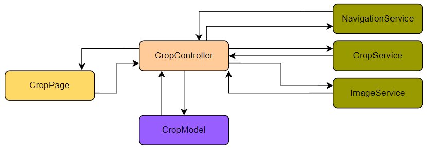

# nodocs

Nodocs is a flutter app to scan documents and manage them.
It provides functionality to scan documents and store them as pdf.
With OCR it makes the pdf searchable for text.
The documents are maneged in folders. The user can navigate through the folders and open the pdfs.
The app also provides a search function to search for pdfs by name, tags or text.

## About NoDocs
The app is scoped to help unstructured people or people who want to save time to 
manage their documents. It provides a simple workflow to store and manage documents.


### Store Documents
To store documents the app provides a feature to scan paper documents and store them as pdf.
The process of scanning a document is structured in a way that the user can scan multiple pages.
Per page the user can choose to crop the image before saving it. 
When saving a document, the user can set the title, tags and the destination folder.
The saved document is processed with OCR to make it searchable for text. <br>
The tags are used to categorize the documents and make them easier to find.  <br>
Another option to add a document is to upload a pdf from the device. On the home screen the 
user can open a context menu for a collection by long pressing on it. 
In the context menu the user can choose to upload a pdf to the selected collection.

### Manage Documents and Collections
The documents are stored in collections. The collections are displayed on the home page,
so the user has fast access to them when opening the app. 
The user can navigate through the collections and open the pdfs.
The user can also search for documents by name, tags or text.
On the home page the user can also create new collections. 

### View Documents
The app provides a pdf viewer to view the documents.
The pdf viewer allows to search for text in the document.
Inside the pdf viewer the user can also edit the tags of a document.


#### Which persona with which characteristics benefits from the app

## Development

### Useful commands

#### Regenerate generated sources

```
dart run build_runner build
```

#### Regenerate splash screens
```
dart run flutter_native_splash:create
```

#### Regenerate icon files
```
flutter pub run flutter_launcher_icons
```

#### Regenerate translation keys
```
dart run easy_localization:generate -S assets/translations -f keys -O lib/gen -o locale_keys.g.dart
```
# Architecture
The app is build with the MVCs paradigm. Each page has their own controller and model. All controllers use additional services.
Those are the views, their controllers, their models, their services and the databases used for this project.

## HomePage
</br></br>
The Home Page needs two controllers. Those will be explained now.
### SearchResultController
This controller focuses on the search feature of the home page.
- The NavigationService is used to open a document from the search results.
- The FileSystemService is used to get the count of a word from the PDFs. It's also used to get the file names in order to search for them.
- The PersistenceService is used to get the Tags from the Isar database as the app allows you to search for this too.

For the search results the model SearchResultModel is used which updates the HomePage.
### HomeController
The HomeController provides the file explorer feature and encapsulates those services:
- The NavigationService is used to go to the Settings/Scan/PdfViewerPage.
- The FilePickerService allows you to upload a file from the devices file system.
- The FileShareService is used to share a PDF or a collection over the system apps.
- The FileSystemService is used to manage the file or collection accessing functions for the 

The HomeModel contains the nodes for the filesystem entities which are displayed in the menu of the HomePage.
## PdfViewerPage
</br></br>
The PdfViewerPage uses those services to handle search results and Tag management:
- The PdfSearchService is used to get all occurrences of a word.
- The NavigationService is used to get back to the page which has called it.
- The PersistenceService uses the Isar database to access existing Tags linked to the document and edit them.

The PdfViewerModel contains the Tags and some flags which have an influence on the PdfViewerPage.
## ScanPage
</br></br>
The ScanPage uses one controller to handle the camera interactions and one controller to handle routing and the management of the images already taken.
### CameraController
This controller enables the camera preview and making of photos. It comes from an own library so this is not described further.
### ScanController
This controller uses those services:
- The NavigationService is used to go to the Crop/Save/HomePage
- The ImageService is used to handle the cached images in order to pass them to the other pages.
## CropPage
</br></br>
The CropPage uses its services to enable the Cropper and to handle the image management.
- The NavigationService is used to go to the Scan/Save/HomePage
- The CropService is used to allow the usage of the image_cropper library
- The ImageService is used for the same case as described above

The CropModel looks like this:
```
class CropModel with _$CropModel {
  const factory CropModel({
    required final List<String> imagePaths,
    required final CroppedFile? croppedFile,
    required final XFile? pickedFile,
  }) = _CropModel;
}
```
The `imagePaths` list is used to replace the cached image after cropping it. 
The `croppedFile` object contains the cropped version of the image.
The `pickedFile` object contains the original image before cropping.
## SavePage
</br></br>
The SavePage is used to set the properties of the document, to change single pages of the document and to save it as an PDF file.
It contains two controllers. The CameraController which is the same one as in the ScanPage and the SaveController. Both will be described now.
### CameraController
On the Page you have the option to retake a single photo. That is supported by the CameraController. It uses the identical view as the ScanPage.
### SaveController
The SaveController contains those services:
- The CropService is used to crop an image again with the image_cropper library
- The NavigationService is used to go to the HomePage
- The FileSystemService is used to save the document in a specific collection
- The OcrService uses an external REST API to OCR the document
- The PersistenceService uses the Isar database to link existing Tags to the document 

In the SaveModel the index of the carousel is saved, the image paths, the Tags, a flag if the camera should be enabled, the title of the document and the destination save path for the document.
## SettingsPage
</br></br>
The SettingsController is used to change the app settings. It contains those services:
- The NavigationService is used to go to the LanguageSettings/TextRecognitionLanguageSettings/HomePage
- The SettingsPersistenceService is used to persist the settings in the Shared Preferences database of the app.

The SettingsModel contains the information if the Pages should be shown in light mode or dark mode. 
## LanguageSettingsPage
</br></br>
The LanguageSettingsController is used to change the language of the app. It contains those services:
- The LanguageEvaluationService is used to evaluate if the given language exist in the localizations. If not, the app is displayed in english. That's required because per default the system language is used. 
- The NavigationService is used to go to the SettingsPage
- The SettingsPersistenceService is used to persist the settings in the Shared Preferences database of the app.

The LanguageSettingsModel contains the selected language code and a map of the available languages.
## TextRecognitionLanguageSettingsPage
</br></br>
The TextRecognitionLanguageSettingsController is used to change the text recognition language of the OCR feature. It contains those services:
- The NavigationService is used to go to the SettingsPage
- The SettingsPersistenceService is used to persist the settings in the Shared Preferences database of the app.

The TextRecognitionLanguageModel contains the selected language code and a map of the available languages.

# User Guide
The following guide describes how to use the App.
## Home Screen
This is the first page you will see if you start the App.
The page itself contains two features and the navigation bar. The two features are the Search feature and the Collection Menu feature.</br>

</br></br>
### Collection Menu
The Collection Menu is kind of a file explorer. You will see all your Collections and PDF documents there. You can open Collections to see what's inside them by clicking on them. You can also click on PDF documents to open them in the PDF Viewer of the app which will be described later.</br>An unfolded collection with documents inside may look like this:</br>
</br></br>
You also have a context menu which you are able to activate with a long press on the collection or the document.
#### Collection Context Menu
When long pressing a collection you will have those options:</br>
</br></br>
- Clicking the `Rename` button will open up a dialog where you can set a new name for the collection (confirm with `Confirm`, cancel with `Cancel`):

</br></br>
- Clicking the `Share` button will "zip" the folder and all files inside, so you can share it across your apps:

</br></br>
- Clicking the `Upload File` button will allow you to upload a file from your file system into the collection.</br>
- Clicking the `Delete` button will open up a confirmation dialog. Warning! If you click on `Confirm` this will delete all files and collections inside the collection. As always cancel with `Cancel`.
#### PDF File Context Menu
When long pressing a PDF you will have those options:</br>
</br></br>
- Clicking `Rename` will allow you to rename the document as described above.
- Clicking `Share` will allow you to share the PDF document.
- Clicking `Delete` will delete the document. That also works the same way as for collections.
### Home Navigation
In the navigation of the home page you can also create new collections by clicking on `New Collection`. Then you will see this dialog where you can insert the name of the new Collection (create with `Create`, cancel with `Cancel`):

</br></br>

Also, you can access the settings by clicking on `Settings`.

And you can scan your documents with the integrated scan feature by clicking on `Scan Document`.

The Settings page and the Scan page are described below.

### Search
The search feature can be opened by pressing the search bar on the home page. In the input field you are able to search for the following things:
- Search for PDF documents by name:

</br>
- Search for Tags by their names:

</br>
- Search for words or characters inside documents (see `n matches found` from the examples above)

When you have found the document you were looking for you can open it in the PDF viewer by clicking on it.

## PDF viewer
The PDF viewer can be opened as described above. It contains two features. The Edit Tags feature and the Search feature which can be accessed by pressing this button:</br>
</br>

### Search
The Search feature allows you to search for a text in the document. After typing in your text you have to click the search button of your keyboard.
You jump to the next occurrence of a word with the right arrow button, and you can jump to the previous occurrence on the left arrow button:</br>
</br>

### Edit Tags
The Tag feature allows you to create new Tags and directly link them to your document. Also, you can remove existing Tags from the document. If you remove a Tag and confirm with `Save` the Tag might be deleted if no other document is linked to this Tag. Another feature is to add an existing Tag from another document to it by selecting them.

All changes made in the Edit Tags Dialog must be confirmed with `Save` in order to persist.

#### Create new Tag
To create a new Tag type in the name of it. Then confirm the Tag with the add Button.</br>
</br>

#### Select/Remove an existing Tag
To select an existing Tag just tap it. To unselect it just tap it again. This way you can also remove Tags from documents.</br>
</br>

## Scan Page
The `Scan Page` can be used to make photos of documents and upload existing photos in order to convert them into a document later.
</br>
Those are the features:
1. The `Scan Document` button captures a photo
2. The gallery icon allows you to add a photo from your gallery
3. The Last Image Preview can be clicked to finish scanning your documents and continue with the PDF creation, Tag adding, Collection selecting, ... (As described under `Save Page`)

After making the photo or uploading it you will land on the Crop Page.
## Crop Page
This page allows you to give your image the final adjustment, so it looks good in the PDF later.
Therefore, you have to click on the `Crop` button. This will open the `Cropper` where you can make those adjustments.

The Navigation Bar offers those features:</br>
</br>
1. The `Retake Photo` button allows you to discard the photo.
2. The `Keep Scanning` button saves the image and allows you to make or upload another image to the document.
3. By clicking the `Save Document` button you will be forwarded to the `Save Page` which is described below.

## Save Page
The `Save Page` is used to do the following:</br>
</br>
1. Set the title of the document
2. Select the Tags which will be linked to the document
3. Select the destination Collection
4. Crop a single page again selected by the current slide of the Carousel
5. Retake the photo of a single page selected by the current slide of the Carousel
6. Save the document as a PDF
7. Save the document as a OCR'ed PDF (internet connection required)

### Set the Title
This can be done by clicking into the line or on the button. Then just type in the title you want to set. Confirm with `OK` on the keyboard.
### Select Tags
This can be done by tapping on the `Select Tags` field. There you can select or unselect existing Tags. You can also remove selected Tags by clicking on the Tag Chip.
### Select Collection
This can be done by tapping on the `Select Collection` field. There you can see your directories previously defined on the Home Page. Please select the directory of destination there.
### Crop Again
This works exactly like on the Crop Page described above.
### Retake
This works exactly like on the Scan Page described above. The only difference is, that you don't have the Last Image Preview there.
### Save
You can save the document as a normal PDF there (without OCR).
### OCR & Save
You can save the document as a OCR'ed PDF there. This will take a few seconds and requires internet connection.


## Settings Page
To get on this page you have to be on the Home Page before.
On this page you can set the Appearance of the app (DarkMode), the App Language and the Text recognition language for the OCR.
